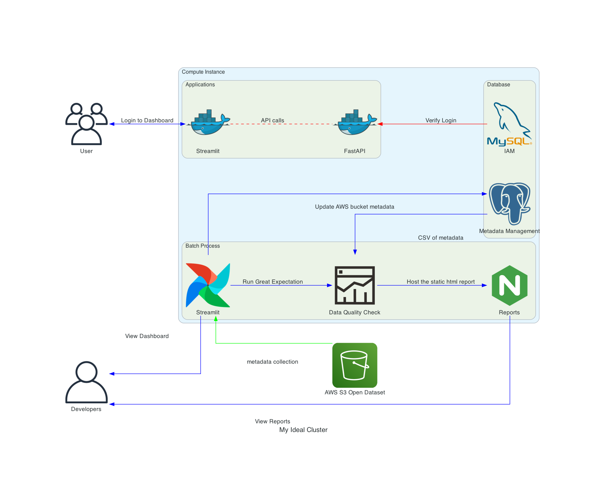
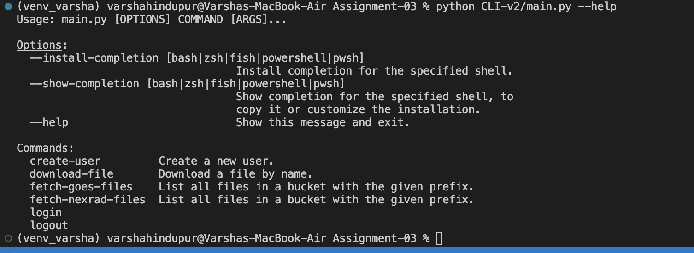
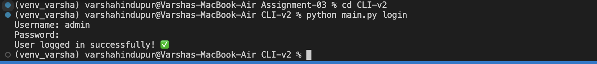

# Assignment 3 (Data Engineering + Web Application Features)

### Overview
This tool gathers weather information from SEVIR that was captured by the NEXRAD and GOES satellites. We are scheduling the jobs by defining DAGs that first collect GOES and NEXRAD satellite data from NOAA's AWS S3 bucket, second populate data into Postgres database, and then convert the data into CSV files. This creates an Extraction-Transformation-Loading (ETL) process to collect real-time data on a daily basis.

## Additional UI Features added
1. We have designed a service plan that allows users to subscribe to Free Tier that allows 10 API request limit and resets everyhour, Gold Tier that allows 15 API request limit and resets everyhour and lastly, a Platinum TIer that allows 20 API request limit and resets everyhour.
2. This application now has a create a user registration page with functionality to register a new user and choosing a plan (defined above). The changing password functionality is also implemented which stores passwords in hashed format.
3. Designed a dashboard within streamlit accessible by the admins only to track users’ activity.

P.S. This note defines the directory structure in brief:
- Frontend Directory: To keep all the Streamlit
- Backend: To keep all files and dir, related to API, AWS, MySQL

# Prerequisites
To run this project, you will need:

- AWS account
- Docker Daemon (Docker Desktop Application downloaded in your system)
- AWS Access, Secret, log access and log secret keys
- .env file containing the AWS keys in the same directory as the Airflow & Main Project folder

**Links to Live Applications**
**Application Link:** http://ec2-52-207-76-7.compute-1.amazonaws.com/

**FastAPI Docs:** http://ec2-52-207-76-7.compute-1.amazonaws.com:8000/docs

**Codelabs:** https://codelabs-preview.appspot.com/?file_id=1OR1bguovlUQ2JJ8-BhAtYwoxhGIKSZdl_HjAuzZdiw4/edit?usp=sharing#0

# Installation

- Clone the repository.
- Create .env in 'Backend' (Streamlit & Fast API folder) and 'Airflow' which will contain the access keys to AWS S3 bucket and Airflow UID using the commands below:
  mkdir -p ./dags ./logs ./plugins
  echo -e "AIRFLOW_UID=$(id -u)" > .env
- Postgres database is used to store GOES and NEXRAD data; MySQL database is used to store the details of Subscription Plans
- Finally, create your own virtual environment by installing virtualenv package ('pip install virtualenv'), using 'py -m venv venv' to create a virtual environment of your own, next step is to download the packages in requirement.txt present in all directories by using 'pip install -r requirements.txt'

### .env file format for airflow:
- AWS_ACCESS_KEY=<aws_access_key>
- AWS_SECRET_KEY=<aws_secret_key>

### .env file details and structure for Streamlit and FASTapi:
SECRET_KEY = 09d25e094fab7la2556c818166b7a9563b93f7099f6f0f4caa6cf63b88e8d3e7
ALGORITHM = HS256
ACCESS_TOKEN_EXPIRE_MINUTES = 30
AWS_ACCESS_KEY=<--mention your aws access key-->
AWS_ACCESS_KEY_SECRET=<--mention your aws access secret key-->
TARGET_BUCKET_NAME=damg7245-team-5
DB_USER=assignemnt_03
DB_PASSWORD=123456789
DB_HOST=localhost
DB_NAME=assignment_03
REDIST_HOST=localhost

# Detailed instructions on how to use the features of this application

- Go to the URL of the Streamlit app (mentioned above as application link)
- Register yourself if you're a new user and select the subscription type (Free, Gold, Platinum)
- After registeration, go to Login page and log into the application with your username and password
- If you're an existing user, please login with your credentials to access the application
- If you have forgotten your password, use our "forgot password" option in the dashboard that sends out an OTP to your registered email
- Search for the GOES-18 or NEXRAD file(s) by passing the file parameters or file name as an input
- After searching two download options will be available,
    1) Download the file from the NOAA's S3 bucket
    2) Download the file via your S3 bucket as it will have the same details available as a download link
- AWS CloudWatch is used for logging the details of all file downloads on the new AWS S3 bucket
- Analytics in the Streamlit app can be viewee which will allow us to understand the API calls made during a particular date and time for all successful attempts made on the application
- After your API call limits have exhausted, you can upgrade your subscription from the dashboard

# Architecture diagram

# A CLI interface at your rescue!
**Steps - How to Use this feature**
(Refer to the folder structure)
- **Step1:** Navigate to CLI-v2 folder and open to main.py and run this python script inside terminal using the commands given below:
  `python main.py --help`
  
  

- **Step2:**    
  These are set of helper commands that will allow the user to login, logout, create-user, download-file, fetch-goes-file, fetch-nexrad-file one-at-a-time
  
  
